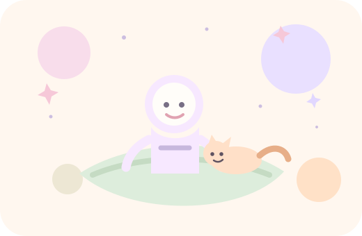

<table>
  <tr>
    <td width="58%" valign="middle">
      <h1>Hello, I'm Suki. Welcome to my universe.</h1>
      

        <strong>I build systems that help people understand, decide, and grow.</strong>
      

      

        Pastel GitHub profile, cozy digital garden, soft space aesthetic, personal universe,
        AI creator, calm tech portfolio, and friendly interface.
      

      

        
        
        
      

    </td>
    <td width="42%" valign="middle" align="center">
      
    </td>
  </tr>
</table>

  

<table>
  <tr>
    <td width="32%" valign="top">
      

        
        <h2>Suki</h2>
        
<strong>@qi00531</strong>

      

       
      

        <strong>Location</strong> 
        Somewhere between Earth and a soft little orbit.
      

      

        <strong>Email</strong> 
        <a href="mailto:hello@suki.dev">hello@suki.dev</a>
      

      

        <strong>Links</strong> 
        <a href="https://github.com/qi00531">GitHub</a> ·
        <a href="https://github.com/qi00531?tab=repositories">Projects</a> ·
        <a href="https://github.com/qi00531?tab=stars">Garden</a>
      

      

        
        
        
      

    </td>
    <td width="68%" valign="top">
      <h2>Project Tags</h2>
      

        
        
        
        
      

      <h2>Current Signal</h2>
      

        I am exploring how AI agents, legal reasoning, learning systems, and product interfaces can make complex decisions feel calmer, clearer, and more human.
      

      <h2>About Me</h2>
      

        I work across AI product thinking, LegalTech workflows, learning experience design, and interactive systems.
        My mission is to build gentle tools for serious thinking: software that helps people understand hard problems,
        make better decisions, and keep growing without feeling overwhelmed.
      

    </td>
  </tr>
</table>

## Featured Projects

<table>
  <tr>
    <td width="50%" valign="top">
      <h3>Administrative Review AI</h3>
      
<strong>Legal reasoning assistant</strong> for administrative review workflows, document structure, and issue analysis.

      

        
        
      

      
<a href="https://github.com/qi00531/administrative-review-ai">View on GitHub</a>

    </td>
    <td width="50%" valign="top">
      <h3>ToolFlow</h3>
      
<strong>Agent workflow system</strong> for chaining tools, planning steps, and turning messy tasks into calm execution paths.

      

        
        
      

      
<a href="https://github.com/qi00531/toolflow">View on GitHub</a>

    </td>
  </tr>
  <tr>
    <td width="50%" valign="top">
      <h3>Learn Later</h3>
      
<strong>Learning capture garden</strong> for saving ideas, transforming them into cards, and returning at the right moment.

      

        
        
      

      
<a href="https://github.com/qi00531/learn-later">View on GitHub</a>

    </td>
    <td width="50%" valign="top">
      <h3>Lost Island</h3>
      
<strong>Interactive experience</strong> about exploration, choices, hidden systems, and playful story-driven interfaces.

      

        
        
      

      
<a href="https://github.com/qi00531/lost-island">View on GitHub</a>

    </td>
  </tr>
</table>

  

## Little Universe Map

<table>
  <tr>
    <td width="25%" align="center"><strong>Legal AI</strong> reasoning · retrieval · trust</td>
    <td width="25%" align="center"><strong>Agent Workflow</strong> planning · tools · feedback</td>
    <td width="25%" align="center"><strong>Learning Systems</strong> memory · cards · growth</td>
    <td width="25%" align="center"><strong>Product Worlds</strong> interfaces · stories · care</td>
  </tr>
</table>
